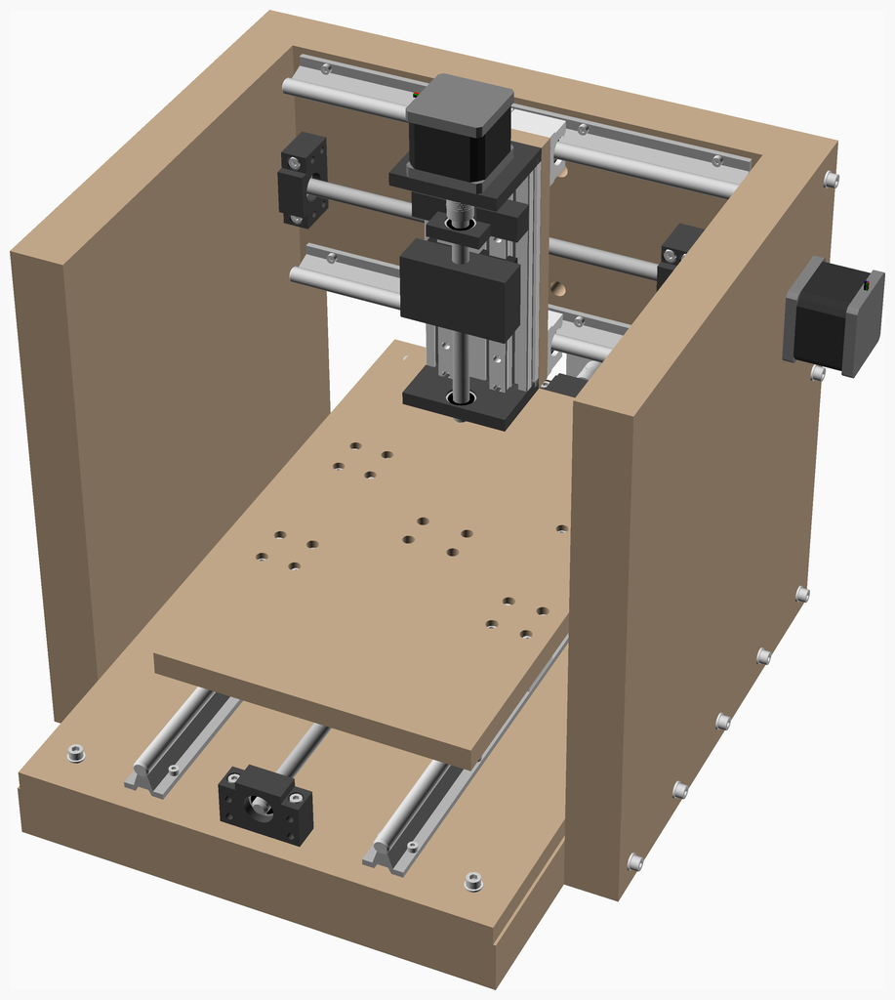
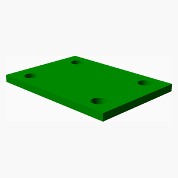
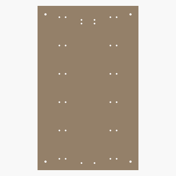
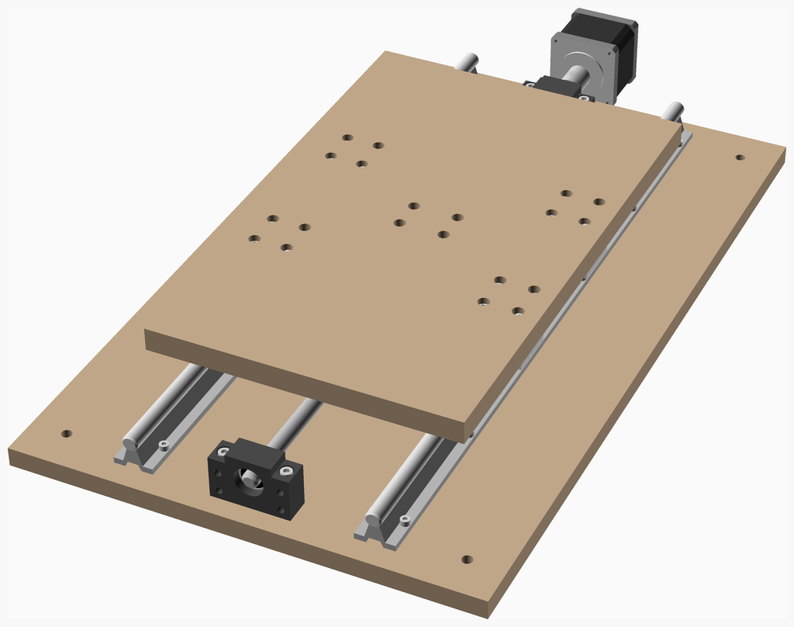
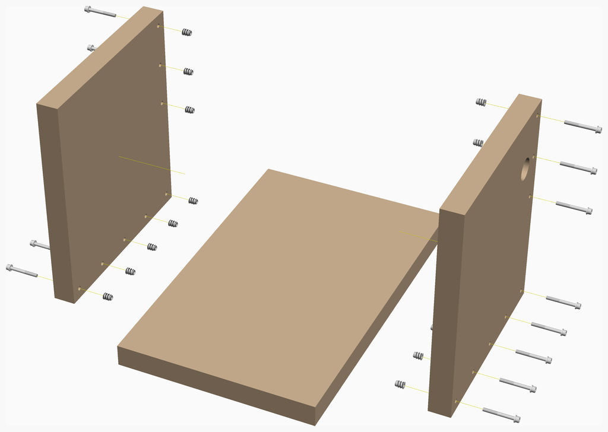
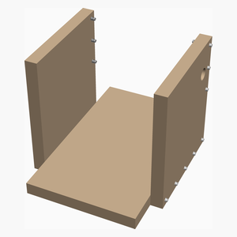
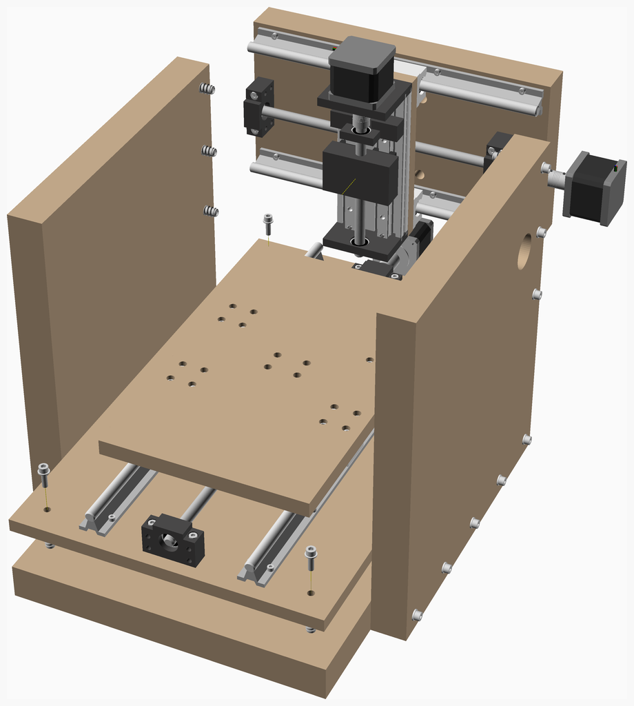

# Srcnc
Small rigid CNC.

---
## Table of Contents
1. [Parts list](#Parts_list)
1. [Yaxis Assembly](#yaxis_assembly)
1. [Frame Assembly](#Frame_assembly)
1. [Main Assembly](#main_assembly)

[Top](#TOP)

---

## Parts list
| Yaxis | Frame | Main | TOTALS |  |
|---:|---:|---:|---:|:---|
|  |  |  | | **Vitamins** |
| &nbsp;&nbsp;.&nbsp; | &nbsp;&nbsp;1&nbsp; | &nbsp;&nbsp;.&nbsp; |  &nbsp;&nbsp;1&nbsp; | &nbsp;&nbsp; Chipboard 360mm x 200mm x 40mm |
| &nbsp;&nbsp;.&nbsp; | &nbsp;&nbsp;1&nbsp; | &nbsp;&nbsp;.&nbsp; |  &nbsp;&nbsp;1&nbsp; | &nbsp;&nbsp; Chipboard 360mm x 580mm x 40mm |
| &nbsp;&nbsp;.&nbsp; | &nbsp;&nbsp;2&nbsp; | &nbsp;&nbsp;.&nbsp; |  &nbsp;&nbsp;2&nbsp; | &nbsp;&nbsp; Chipboard 400mm x 360mm x 40mm |
| &nbsp;&nbsp;1&nbsp; | &nbsp;&nbsp;.&nbsp; | &nbsp;&nbsp;.&nbsp; |  &nbsp;&nbsp;1&nbsp; | &nbsp;&nbsp; Lead Screw Nut Housing |
| &nbsp;&nbsp;1&nbsp; | &nbsp;&nbsp;.&nbsp; | &nbsp;&nbsp;.&nbsp; |  &nbsp;&nbsp;1&nbsp; | &nbsp;&nbsp; Leadscrew 12 x 550mm, 4mm lead, 1 starts |
| &nbsp;&nbsp;1&nbsp; | &nbsp;&nbsp;.&nbsp; | &nbsp;&nbsp;.&nbsp; |  &nbsp;&nbsp;1&nbsp; | &nbsp;&nbsp; Leadscrew nut for SFU1204 |
| &nbsp;&nbsp;16&nbsp; | &nbsp;&nbsp;.&nbsp; | &nbsp;&nbsp;.&nbsp; |  &nbsp;&nbsp;16&nbsp; | &nbsp;&nbsp; Nut M5 x 4mm  |
| &nbsp;&nbsp;2&nbsp; | &nbsp;&nbsp;.&nbsp; | &nbsp;&nbsp;.&nbsp; |  &nbsp;&nbsp;2&nbsp; | &nbsp;&nbsp; SBR12 rail, length 550mm |
| &nbsp;&nbsp;4&nbsp; | &nbsp;&nbsp;.&nbsp; | &nbsp;&nbsp;.&nbsp; |  &nbsp;&nbsp;4&nbsp; | &nbsp;&nbsp; SBR12UU bearing block |
| &nbsp;&nbsp;6&nbsp; | &nbsp;&nbsp;.&nbsp; | &nbsp;&nbsp;.&nbsp; |  &nbsp;&nbsp;6&nbsp; | &nbsp;&nbsp; Screw M4 cap x 15mm |
| &nbsp;&nbsp;16&nbsp; | &nbsp;&nbsp;.&nbsp; | &nbsp;&nbsp;.&nbsp; |  &nbsp;&nbsp;16&nbsp; | &nbsp;&nbsp; Screw M5 cap x 18mm |
| &nbsp;&nbsp;16&nbsp; | &nbsp;&nbsp;.&nbsp; | &nbsp;&nbsp;.&nbsp; |  &nbsp;&nbsp;16&nbsp; | &nbsp;&nbsp; Screw M5 cap x 20mm |
| &nbsp;&nbsp;4&nbsp; | &nbsp;&nbsp;.&nbsp; | &nbsp;&nbsp;.&nbsp; |  &nbsp;&nbsp;4&nbsp; | &nbsp;&nbsp; Screw M6 cap x 20mm |
| &nbsp;&nbsp;.&nbsp; | &nbsp;&nbsp;16&nbsp; | &nbsp;&nbsp;.&nbsp; |  &nbsp;&nbsp;16&nbsp; | &nbsp;&nbsp; Screw M6 cap x 55mm |
| &nbsp;&nbsp;1&nbsp; | &nbsp;&nbsp;.&nbsp; | &nbsp;&nbsp;.&nbsp; |  &nbsp;&nbsp;1&nbsp; | &nbsp;&nbsp; Shaft coupling SC_8x8_flex |
| &nbsp;&nbsp;1&nbsp; | &nbsp;&nbsp;.&nbsp; | &nbsp;&nbsp;.&nbsp; |  &nbsp;&nbsp;1&nbsp; | &nbsp;&nbsp; Sheet MDF 356mm x 580mm x 15mm |
| &nbsp;&nbsp;1&nbsp; | &nbsp;&nbsp;.&nbsp; | &nbsp;&nbsp;.&nbsp; |  &nbsp;&nbsp;1&nbsp; | &nbsp;&nbsp; Stepper motor NEMA22 x 51.2mm (6.35x24 shaft) |
| &nbsp;&nbsp;4&nbsp; | &nbsp;&nbsp;16&nbsp; | &nbsp;&nbsp;.&nbsp; |  &nbsp;&nbsp;20&nbsp; | &nbsp;&nbsp; Threaded insert M6 x 15mm |
| &nbsp;&nbsp;16&nbsp; | &nbsp;&nbsp;.&nbsp; | &nbsp;&nbsp;.&nbsp; |  &nbsp;&nbsp;16&nbsp; | &nbsp;&nbsp; Washer  M5 x 10mm x 1mm |
| &nbsp;&nbsp;4&nbsp; | &nbsp;&nbsp;16&nbsp; | &nbsp;&nbsp;.&nbsp; |  &nbsp;&nbsp;20&nbsp; | &nbsp;&nbsp; Washer  M6 x 12.5mm x 1.5mm |
| &nbsp;&nbsp;94&nbsp; | &nbsp;&nbsp;52&nbsp; | &nbsp;&nbsp;.&nbsp; | &nbsp;&nbsp;146&nbsp; | &nbsp;&nbsp;Total vitamins count |
|  |  |  | | **3D printed parts** |
| &nbsp;&nbsp;1&nbsp; | &nbsp;&nbsp;.&nbsp; | &nbsp;&nbsp;.&nbsp; |  &nbsp;&nbsp;1&nbsp; | &nbsp;&nbsp;nut_housing_adapter.stl |
| &nbsp;&nbsp;1&nbsp; | &nbsp;&nbsp;.&nbsp; | &nbsp;&nbsp;.&nbsp; | &nbsp;&nbsp;1&nbsp; | &nbsp;&nbsp;Total 3D printed parts count |
|  |  |  | | **CNC routed parts** |
| &nbsp;&nbsp;.&nbsp; | &nbsp;&nbsp;1&nbsp; | &nbsp;&nbsp;.&nbsp; |  &nbsp;&nbsp;1&nbsp; | &nbsp;&nbsp;frame_back_side.dxf |
| &nbsp;&nbsp;.&nbsp; | &nbsp;&nbsp;1&nbsp; | &nbsp;&nbsp;.&nbsp; |  &nbsp;&nbsp;1&nbsp; | &nbsp;&nbsp;frame_bottom_side.dxf |
| &nbsp;&nbsp;.&nbsp; | &nbsp;&nbsp;1&nbsp; | &nbsp;&nbsp;.&nbsp; |  &nbsp;&nbsp;1&nbsp; | &nbsp;&nbsp;frame_left_side.dxf |
| &nbsp;&nbsp;.&nbsp; | &nbsp;&nbsp;1&nbsp; | &nbsp;&nbsp;.&nbsp; |  &nbsp;&nbsp;1&nbsp; | &nbsp;&nbsp;frame_right_side.dxf |
| &nbsp;&nbsp;1&nbsp; | &nbsp;&nbsp;.&nbsp; | &nbsp;&nbsp;.&nbsp; |  &nbsp;&nbsp;1&nbsp; | &nbsp;&nbsp;yplate.dxf |
| &nbsp;&nbsp;1&nbsp; | &nbsp;&nbsp;4&nbsp; | &nbsp;&nbsp;.&nbsp; | &nbsp;&nbsp;5&nbsp; | &nbsp;&nbsp;Total CNC routed parts count |

[Top](#TOP)

---

## Yaxis Assembly
### Vitamins
|Qty|Description|
|---:|:----------|
|1| Lead Screw Nut Housing|
|1| Leadscrew 12 x 550mm, 4mm lead, 1 starts|
|1| Leadscrew nut for SFU1204|
|16| Nut M5 x 4mm |
|2| SBR12 rail, length 550mm|
|4| SBR12UU bearing block|
|6| Screw M4 cap x 15mm|
|16| Screw M5 cap x 18mm|
|16| Screw M5 cap x 20mm|
|4| Screw M6 cap x 20mm|
|1| Shaft coupling SC_8x8_flex|
|1| Sheet MDF 356mm x 580mm x 15mm|
|1| Stepper motor NEMA22 x 51.2mm (6.35x24 shaft)|
|4| Threaded insert M6 x 15mm|
|16| Washer  M5 x 10mm x 1mm|
|4| Washer  M6 x 12.5mm x 1.5mm|

### 3D Printed parts

| 1 x [nut_housing_adapter.stl](stls/nut_housing_adapter.stl) |
|---|
|  

### CNC Routed parts

| 1 x [yplate.dxf](dxfs/yplate.dxf) |
|---|
|  

### Assembly instructions

[Top](#TOP)

---

## Frame Assembly
### Vitamins
|Qty|Description|
|---:|:----------|
|1| Chipboard 360mm x 200mm x 40mm|
|1| Chipboard 360mm x 580mm x 40mm|
|2| Chipboard 400mm x 360mm x 40mm|
|16| Screw M6 cap x 55mm|
|16| Threaded insert M6 x 15mm|
|16| Washer  M6 x 12.5mm x 1.5mm|

### CNC Routed parts

| 1 x [frame_back_side.dxf](dxfs/frame_back_side.dxf) | 1 x [frame_bottom_side.dxf](dxfs/frame_bottom_side.dxf) | 1 x [frame_left_side.dxf](dxfs/frame_left_side.dxf) |
|---|---|---|
|  |  |  

| 1 x [frame_right_side.dxf](dxfs/frame_right_side.dxf) |
|---|
|  

### Assembly instructions

[Top](#TOP)

---

## Main Assembly
### Sub-assemblies

| 1 x Frame_assembly | 1 x yaxis_assembly |
|---|---|
|  |  

### Assembly instructions

Assembly instructions in Markdown format in front of each module that makes an assembly.

[Top](#TOP)
