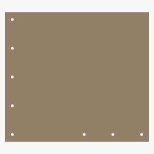

# Srcnc
Small rigid CNC.

---
## Table of Contents
1. [Parts list](#Parts_list)
1. [Frame Assembly](#Frame_assembly)

[Top](#TOP)

---

## Parts list
| Frame | TOTALS |  |
|---:|---:|:---|
|  | | **Vitamins** |
| &nbsp;&nbsp;1&nbsp; |  &nbsp;&nbsp;1&nbsp; | &nbsp;&nbsp; Chipboard 360mm x 200mm x 40mm |
| &nbsp;&nbsp;2&nbsp; |  &nbsp;&nbsp;2&nbsp; | &nbsp;&nbsp; Chipboard 400mm x 360mm x 40mm |
| &nbsp;&nbsp;3&nbsp; | &nbsp;&nbsp;3&nbsp; | &nbsp;&nbsp;Total vitamins count |
|  | | **CNC routed parts** |
| &nbsp;&nbsp;1&nbsp; |  &nbsp;&nbsp;1&nbsp; | &nbsp;&nbsp;frame_back_side.dxf |
| &nbsp;&nbsp;1&nbsp; |  &nbsp;&nbsp;1&nbsp; | &nbsp;&nbsp;frame_left_side.dxf |
| &nbsp;&nbsp;1&nbsp; |  &nbsp;&nbsp;1&nbsp; | &nbsp;&nbsp;frame_right_side.dxf |
| &nbsp;&nbsp;3&nbsp; | &nbsp;&nbsp;3&nbsp; | &nbsp;&nbsp;Total CNC routed parts count |

[Top](#TOP)

---

## Frame Assembly
### Vitamins
|Qty|Description|
|---:|:----------|
|1| Chipboard 360mm x 200mm x 40mm|
|2| Chipboard 400mm x 360mm x 40mm|

### CNC Routed parts

| 1 x [frame_back_side.dxf](dxfs/frame_back_side.dxf) | 1 x [frame_left_side.dxf](dxfs/frame_left_side.dxf) | 1 x [frame_right_side.dxf](dxfs/frame_right_side.dxf) |
|---|---|---|
|  |  |  

### Assembly instructions

[Top](#TOP)

---
Assembly instructions in Markdown format in front of each module that makes an assembly.

[Top](#TOP)
