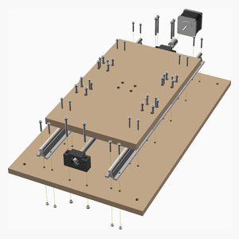
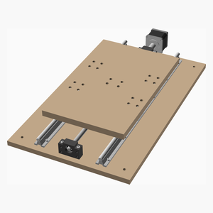

# Srcnc
Small rigid CNC.

---
## Table of Contents
1. [Parts list](#Parts_list)
1. [Yaxis Assembly](#yaxis_assembly)

[Top](#TOP)

---

## Parts list
| Yaxis | TOTALS |  |
|---:|---:|:---|
|  | | **Vitamins** |
| &nbsp;&nbsp;1&nbsp; |  &nbsp;&nbsp;1&nbsp; | &nbsp;&nbsp; Lead Screw Nut Housing |
| &nbsp;&nbsp;1&nbsp; |  &nbsp;&nbsp;1&nbsp; | &nbsp;&nbsp; Leadscrew 12 x 550mm, 4mm lead, 1 starts |
| &nbsp;&nbsp;1&nbsp; |  &nbsp;&nbsp;1&nbsp; | &nbsp;&nbsp; Leadscrew nut for SFU1204 |
| &nbsp;&nbsp;2&nbsp; |  &nbsp;&nbsp;2&nbsp; | &nbsp;&nbsp; SBR12 rail, length 550mm |
| &nbsp;&nbsp;4&nbsp; |  &nbsp;&nbsp;4&nbsp; | &nbsp;&nbsp; SBR12UU bearing block |
| &nbsp;&nbsp;6&nbsp; |  &nbsp;&nbsp;6&nbsp; | &nbsp;&nbsp; Screw M4 cap x 15mm |
| &nbsp;&nbsp;16&nbsp; |  &nbsp;&nbsp;16&nbsp; | &nbsp;&nbsp; Screw M5 cap x 18mm |
| &nbsp;&nbsp;16&nbsp; |  &nbsp;&nbsp;16&nbsp; | &nbsp;&nbsp; Screw M5 cap x 20mm |
| &nbsp;&nbsp;47&nbsp; | &nbsp;&nbsp;47&nbsp; | &nbsp;&nbsp;Total vitamins count |

[Top](#TOP)

---

## Yaxis Assembly
### Vitamins
|Qty|Description|
|---:|:----------|
|1| Lead Screw Nut Housing|
|1| Leadscrew 12 x 550mm, 4mm lead, 1 starts|
|1| Leadscrew nut for SFU1204|
|2| SBR12 rail, length 550mm|
|4| SBR12UU bearing block|
|6| Screw M4 cap x 15mm|
|16| Screw M5 cap x 18mm|
|16| Screw M5 cap x 20mm|

### Assembly instructions

[Top](#TOP)

---
Assembly instructions in Markdown format in front of each module that makes an assembly.

[Top](#TOP)
